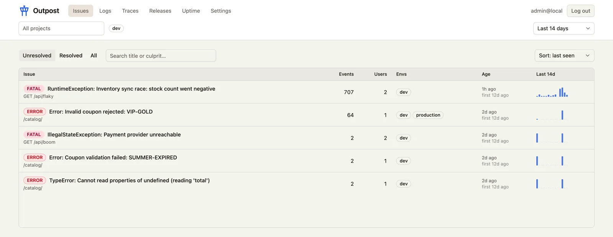

<div align="center">


# Outpost

**Self-hosted error tracking, logs, tracing, and uptime monitoring -<br>powered by the Sentry SDKs you already use.**

<a href="https://github.com/skolldev/outpost/actions/workflows/ci.yml"></a>
<a href="LICENSE"></a>
<a href="server/build.gradle"></a>
<a href="ui/package.json"></a>

</div>

Outpost is on-premises observability for individuals and teams who want error monitoring
without Sentry's breadth or operational complexity. Point any Sentry SDK at it by changing
one DSN - no vendor account, no code changes, no telemetry leaving your network.

Three containers, one database. That's the whole product.

```bash
git clone https://github.com/skolldev/outpost.git && cd outpost
docker compose up -d          # UI at http://localhost:8088 - login: admin@local / change-me
```

<picture>
  <source media="(prefers-color-scheme: dark)" srcset="docs/images/screens/issues-dark.webp">
  
</picture>

---

## Why Outpost

- **Your SDKs already work.** Outpost speaks the Sentry envelope protocol, so
  `@sentry/angular`, `sentry-spring-boot`, and friends need nothing but a new DSN.
- **One durable dependency.** PostgreSQL. No Kafka, no Redis, no ClickHouse, no object
  store
- **Small enough to reason about.** A single Spring Boot process, an nginx-served Angular
  app, and a database - deployed as a single instance, on purpose
- **Your data stays yours.** Single-tenant, self-hosted, AGPL-licensed.

## Features

|                              |                                                                                                                                                                            |
| ---------------------------- | -------------------------------------------------------------------------------------------------------------------------------------------------------------------------- |
| **Error monitoring**         | Events grouped into Issues by fingerprint, with culprit detection, stack traces, breadcrumbs, request/user context, and per-event attachments. Triage state on each Issue. |
| **Logs**                     | Structured Log Records with severity, message body, and searchable attributes, correlated back to the Trace and Span that emitted them.                                    |
| **Distributed tracing**      | Transactions and Spans across services, rendered as a waterfall with span attributes, plus correlated Events and Log Records for the same Trace ID.                        |
| **Releases & symbolication** | Upload source maps with `sentry-cli`; minified stack frames are reconstructed to original source locations via Debug IDs.                                                  |
| **Uptime monitoring**        | Per-project HTTP probes with latency history; three consecutive failures open an Incident.                                                                                 |
| **Notifications**            | Microsoft Teams Adaptive Cards and a [generic JSON webhook](docs/notifications/generic-json-payload.md) for new Issues and Incident start/resolve, scoped per project.     |
| **Access control**           | Session auth with Admin and Member roles, revocable per-project DSN keys, and scoped API Tokens for automation.                                                            |
| **Data retention**           | Optional installation-wide retention window                                                                                                                                |

Cross-cutting project / environment / time-range filters apply across every view and are
kept in the URL, so any screen you're looking at is a link you can share.

## Quick start

Requires Docker. The bundled `docker-compose.yml` builds both images from source on first
run:

```bash
docker compose up -d
```

Open `http://localhost:8088` and sign in with the seeded admin credentials

### Send it some telemetry

Create a Project in `Settings -> Projects`. Outpost shows you a DSN:

```
http://<project-key>@localhost:8088/<project-id>
```

Drop that into your app's existing Sentry configuration - nothing else changes:

```ts
// Angular
Sentry.init({
  dsn: "http://<project-key>@localhost:8088/<project-id>",
  environment: "production",
  release: "my-app@1.4.0",
  tracesSampleRate: 1.0,
});
```

```yaml
# Spring Boot (application.yml)
sentry:
  dsn: http://<project-key>@localhost:8088/<project-id>
  environment: production
  release: my-api@1.4.0
  traces-sample-rate: 1.0
```

Environments and Releases are created automatically on first ingest - there is nothing to
register up front.

### Or run the demo apps

The repo ships an instrumented demo shop (Angular + Spring Boot) that generates real
errors, logs, and traces against your local instance:

```bash
docker compose --profile demo up -d --build     # demo shop at http://localhost:4300
```

See [`demo/README.md`](demo/README.md) for the project-seeding and DSN steps.

## Compatibility

Outpost implements the subset of the Sentry protocol that its features need:

| Endpoint                                                        | Status                                                                                               |
| --------------------------------------------------------------- | ---------------------------------------------------------------------------------------------------- |
| `POST /api/{project}/envelope/`                                 | Errors, transactions, spans, logs, attachments. Client reports are accepted and counted, not stored. |
| `POST /api/0/.../chunk-upload/`, `.../artifactbundle/assemble/` | `sentry-cli` source map upload                                                                       |
| `POST /api/{project}/security/`, `/minidump/`                   | Not implemented (`404`)                                                                              |

"Sentry-compatible" means SDK ingest and `sentry-cli` artifact upload work. It is **not** a
drop-in replacement for the Sentry API or feature set.

## Deployment

Outpost runs as three containers: the API server, the nginx UI (which serves the app and
proxies both browser API calls and SDK ingest to the server), and Postgres. **Only the UI
needs to be exposed.** The backend assumes a single instance - do not scale it
horizontally.

Images: `outpost/outpost-server` and `outpost/outpost-ui`.

### Docker Compose

Self-contained - nothing to clone or build:

```yaml
# compose.yml
services:
  outpost:
    image: outpost/outpost-server:latest
    restart: unless-stopped
    environment:
      OUTPOST_DB_URL: jdbc:postgresql://db:5432/outpost
      OUTPOST_DB_USER: outpost
      OUTPOST_DB_PASSWORD: <strong-password>
      OUTPOST_PUBLIC_URL: https://outpost.example.com
      OUTPOST_ADMIN_EMAIL: you@example.com
      OUTPOST_ADMIN_PASSWORD: <strong-password>
    depends_on: { db: { condition: service_healthy } }

  ui:
    image: outpost/outpost-ui:latest
    restart: unless-stopped
    ports: ["8088:80"]
    environment: { OUTPOST_API_URL: "http://outpost:8080" }
    depends_on: [outpost]

  db:
    image: postgres:17-alpine
    restart: unless-stopped
    environment:
      {
        POSTGRES_DB: outpost,
        POSTGRES_USER: outpost,
        POSTGRES_PASSWORD: <strong-password>,
      }
    volumes: ["outpost-pg:/var/lib/postgresql/data"]
    healthcheck: { test: ["CMD-SHELL", "pg_isready -U outpost"], interval: 5s }

volumes: { outpost-pg: {} }
```

Put a TLS-terminating reverse proxy (Caddy, Traefik, nginx) in front of port 8088 and point
`OUTPOST_PUBLIC_URL` at the URL it serves - that value is rendered into the DSNs shown in
the UI and into notification deep links. Postgres data lives in the `outpost-pg` named
volume; back that up.

### Kubernetes

There are no manifests in the repo; the example below is the minimal shape. Provision
Postgres however you normally do (managed database or an operator such as CloudNativePG).

```yaml
apiVersion: apps/v1
kind: Deployment
metadata: { name: outpost-server }
spec:
  replicas: 1 # single-instance by design - do not scale up
  strategy: { type: Recreate } # avoid two instances running during rollout
  selector: { matchLabels: { app: outpost-server } }
  template:
    metadata: { labels: { app: outpost-server } }
    spec:
      containers:
        - name: server
          image: outpost/outpost-server:latest
          ports: [{ containerPort: 8080 }]
          env:
            - {
                name: OUTPOST_DB_URL,
                value: "jdbc:postgresql://<postgres-host>:5432/outpost",
              }
            - { name: OUTPOST_DB_USER, value: outpost }
            - { name: OUTPOST_PUBLIC_URL, value: "https://outpost.example.com" }
            - { name: OUTPOST_ADMIN_EMAIL, value: "you@example.com" }
            - name: OUTPOST_DB_PASSWORD
              valueFrom: { secretKeyRef: { name: outpost, key: db-password } }
            - name: OUTPOST_ADMIN_PASSWORD
              valueFrom:
                { secretKeyRef: { name: outpost, key: admin-password } }
          livenessProbe: { httpGet: { path: /healthz, port: 8080 } }
          readinessProbe: { httpGet: { path: /readyz, port: 8080 } }
---
apiVersion: apps/v1
kind: Deployment
metadata: { name: outpost-ui }
spec:
  replicas: 1
  selector: { matchLabels: { app: outpost-ui } }
  template:
    metadata: { labels: { app: outpost-ui } }
    spec:
      containers:
        - name: ui
          image: outpost/outpost-ui:latest
          ports: [{ containerPort: 80 }]
          env: [{ name: OUTPOST_API_URL, value: "http://outpost-server:8080" }]
          readinessProbe: { httpGet: { path: /nginx-healthz, port: 80 } }
```

Add to that a `Secret` named `outpost` holding `db-password` and `admin-password`, a
`Service` per Deployment (`outpost-server` on 8080, `outpost-ui` on 80), and an Ingress
routing `/` to the `outpost-ui` service with TLS via your usual mechanism.

## Configuration

All configuration is environment variables.

**Server**

| Variable                                          | Default                                    | What                                                                                                       |
| ------------------------------------------------- | ------------------------------------------ | ---------------------------------------------------------------------------------------------------------- |
| `OUTPOST_DB_URL`                                  | `jdbc:postgresql://localhost:5432/outpost` | Postgres JDBC URL                                                                                          |
| `OUTPOST_DB_USER`                                 | `outpost`                                  | database user                                                                                              |
| `OUTPOST_DB_PASSWORD`                             | `outpost`                                  | database password                                                                                          |
| `OUTPOST_PUBLIC_URL`                              | `http://localhost:8080`                    | public base URL of this instance - rendered into the DSNs shown in the UI and into notification deep links |
| `OUTPOST_ADMIN_EMAIL`                             | -                                          | first-run admin seed                                                                                       |
| `OUTPOST_ADMIN_PASSWORD`                          | -                                          | first-run admin seed                                                                                       |
| `OUTPOST_INGEST_MAX_ENVELOPE_WIRE_BYTES`          | `4194304` (4 MiB)                          | maximum envelope bytes read before decoding; applies to compressed and uncompressed requests               |
| `OUTPOST_INGEST_MAX_ENVELOPE_DECOMPRESSED_BYTES`  | `20971520` (20 MiB)                        | maximum bytes retained after gzip decoding                                                                 |

**UI**

| Variable          | Default               | What                                         |
| ----------------- | --------------------- | -------------------------------------------- |
| `OUTPOST_API_URL` | `http://outpost:8080` | upstream the nginx proxy forwards `/api/` to |

**Health endpoints:** `GET /healthz` (server liveness), `GET /readyz` (server readiness,
checks the database), `GET /nginx-healthz` (UI container).

## Development

| Path        | What                                                                                                                         |
| ----------- | ---------------------------------------------------------------------------------------------------------------------------- |
| `server/`   | Spring Boot 4 / Java 25 backend (Gradle). Ingest API, processing pipeline, query API. Plain JDBC, Flyway migrations, no ORM. |
| `ui/`       | Angular 22 frontend (pnpm). Standalone components, signals, Tailwind v4, spartan/ui.                                         |
| `demo/`     | Sentry-instrumented demo shop that feeds Outpost real telemetry. Not part of the product.                                    |
| `docs/adr/` | Architecture decision records.                                                                                               |

Start Postgres, then run each side natively for fast iteration:

```bash
docker compose up -d db

cd server && ./gradlew bootRun          # API on :8080
cd ui && pnpm install && pnpm start     # dev server on :4200, proxies /api to :8080
```

Node ≥ 24.15 is required; the Java 25 toolchain is auto-provisioned by Gradle.

**Tests**

```bash
cd server && ./gradlew test    # integration tests via Testcontainers (Docker required)
cd ui && pnpm test
```

**Rebuilding containers.** The compose stack runs pre-built images, so `docker compose
restart` will _not_ pick up code changes - rebuild and recreate:

```bash
docker compose up -d --build outpost    # or: ui
```

## Documentation

- [Architecture decision records](docs/adr/) - why single-instance, why Postgres only, why
  best-effort ingestion
- [Domain glossary](CONTEXT.md) - the vocabulary used throughout the code and UI
- [Notification payloads](docs/notifications/) - generic JSON and Teams Adaptive Card formats

## Contributing

Issues and pull requests are welcome. CI runs lint, format check, build, and tests for both
`ui/` and `server/` - please make sure those pass locally first. Conventions for each side
live in `server/CLAUDE.md` and `ui/CLAUDE.md`.

## License

[GNU AGPL v3](LICENSE). Outpost is not affiliated with or endorsed by Sentry; "Sentry" is a
trademark of Functional Software, Inc.
